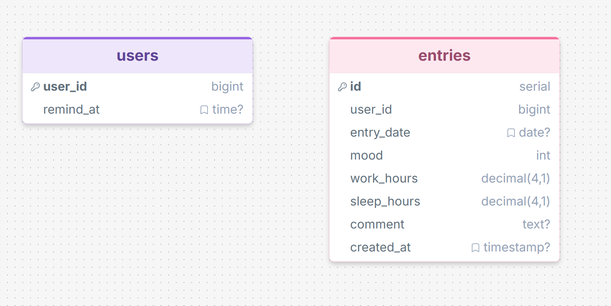

# PROJECT_TelegramBOT_with_PostgreSQL

## 📄 Описание проекта

**Atmosphere or Vibe** — это персональный телеграм-бот для отслеживания ежедневного самочувствия и продуктивности, который помогает выявлять скрытые закономерности в вашем распорядке дня на основе реальных данных.

### 🎯 Зачем это нужно?

Часто мы не замечаем, как мелкие привычки влияют на наше состояние. Бот помогает ответить на важные вопросы:

> • *«В какие дни моё настроение было выше?»*  
> • *«Влияет ли долгая учёба на усталость?»*  
> • *«Есть ли связь между количеством сна и продуктивностью?»*


### 🔧 Как это работает?

#### 1️⃣ Сбор данных
Ежедневно бот запрашивает у пользователя три ключевых показателя:

| Показатель | Диапазон | Описание |
|------------|----------|----------|
| 😊 Настроение | `1–5` | Субъективная оценка самочувствия |
| 💼 Продуктивность | `0–24 ч` | Часы продуктивной работы или учёбы |
| 😴 Сон | `0–24 ч` | Продолжительность ночного сна |

#### 2️⃣ Хранение
✅ Все данные структурированно сохраняются в **PostgreSQL**:
- Привязка к `user_id` для мультипользовательской работы
- История изменений с точной датой
- Надёжность и масштабируемость за счёт реляционной БД

#### 3️⃣ Аналитика
📈 С помощью SQL-запросов и `matplotlib` бот строит персональные графики и выявляет зависимости:
- Динамика настроения за неделю/месяц
- Корреляция «сон → продуктивность»
- Инсайты в зависимости от показателей

#### 4️⃣ Результат
🎁 Пользователь получает:
- 📊 Визуальные отчёты в виде изображений
- 💡 Персонализированные инсайты («Вы продуктивнее после 7 часов сна»)
- 🔄 Напоминание о времени отсчёта с возможностью настройки

### 🛠 Технологический стек

```text
🤖 Бот:          pyTelegramBotAPI (telebot)
🗄 База данных:   PostgreSQL + psycopg2
📈 Графики:      matplotlib + Pillow
🐍 Язык:         Python 
⏱️ Напоминание:  APScheduler
```

## Инструкция по запуску

- Создать файл .env в главной директории
- Скопировать значения из .env.example и вставить в .env
- Изменить значения для всех полей в зависимости от содержимого на ваши данные
- База данных: PostgreSQL 
- Создать все таблицы из schema.sql в базе данных указанной в .env
- Версия Python 3.10+
- Установить все библиотеки из файла requirements.txt (pip install -r requirements.txt)


## Схема БД
